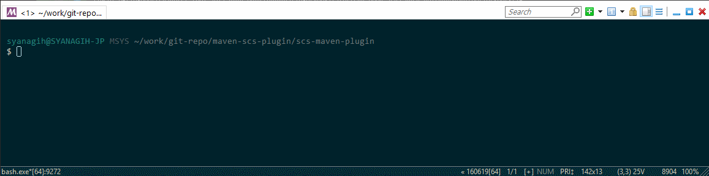

# Maven Plugin for Oracle Storage Cloud Service

This is a Maven plugin for Oracle Storage Cloud Service.
It enables you to list, create, and delete Storage Container.

## Description

Oracle Storage Cloud Service is required for variable Oracle Cloud Services,
for storing log files, backup images or VM Images.
You have to manage storage container area not for reachin the limit capacity.

Storage Cloud Service has been implemented with REST API though,
it is more convenient if you could manage on CLI or IDE.
This plugin enables to manage it with Maven Command.

## Demo



## Features

This plugin has the following feature:

- List storage containers
- Show objects in the container
- Create a storage container
- Delete a storage container
- Delete a object in the container
- Delete all objects in the container
- Upload a object to the container

## Requirement

- Maven 3
- Java 1.8

## Usage

### List storage containers

- command: `scs:list`

### Show objects in the container

- command: `scs:show`

Configure target container under `configuration` element in pom.xml

```xml
<configuration>
    <storage>_apaas</storage>
</configuration>
```

### Create a storage container

- command: `scs:create`

You configure target container under `configuration` element in pom.xml

```xml
<configuration>
    <storage>_apaas</storage>
</configuration>
```

### Delete a storage container

- command: `scs:delete`

You configure target container under `configuration` element in pom.xml

```xml
<configuration>
    <storage>_apaas</storage>
</configuration>
```

### Delete a object in the container

- command: `scs:delete-object`

You configure target container and object under `configuration` element in pom.xml

```xml
<configuration>
    <storage>_apaas</storage>
    <object>springboot/2349df27-fec1-4b14-9009-b530416aa684/logs/web.1/47dff299-bdc3-4204-8326-6b1780aeac0a/server.out.zip</object>
</configuration>
```

### Delete all objects in the container

- command: `scs:delete-objects`

You configure target container under `configuration` element in pom.xml

```xml
<configuration>
    <storage>_apaas</storage>
</configuration>
```

### Upload a object to the container

- command: `scs:upload-object`

You configure target container and object under `configuration` element in pom.xml

```xml
<configuration>
    <storage>_apaas</storage>
    <object>SampleApp.zip</object>
</configuration>
```

## Installation

Add the plugin as a dependency in your Maven project.
All you have to do is the configuration of your credentials for Oracle Cloud.

```xml
...
<plugin>
    <groupId>com.oracle.jp.shinyay</groupId>
    <artifactId>scs-maven-plugin</artifactId>
    <version>1.0-SNAPSHOT</version>
    <configuration>
        <identitydomain>YOUR_IDENTITY_DOMAIN</identitydomain>
        <user>YOUR_CLOUD_USERID</user>
        <password>YOUR_CLOUD_PASSWORD</password>
        <storage>TARGET_STORAGE_CONTAINER</storage>
        <object>TARGET_STORAGE_OBJECT</object>
    </configuration>
</plugin>
...
```

## Licence

Released under the [MIT license](https://gist.githubusercontent.com/shinyay/56e54ee4c0e22db8211e05e70a63247e/raw/44f0f4de510b4f2b918fad3c91e0845104092bff/LICENSE)

## Author

[shinyay](https://github.com/shinyay)
