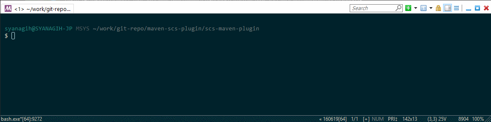

# Maven Plugin for Oracle Storage Cloud Service

Oracle Storage Cloud Service 用の Maven プラグインです。このプラグインにより、Orace Storage Cloud Service 上の操作を統合開発環境上や、CLI などから Maven コマンドを介して操作できるようになります。

## 説明

Oracle Storage Cloud Service は、文字通り記憶領域としてオブジェクト・ストレージを提供するクラウドサービスです。
この Storage Cloud Service は、様々な使用方法があります。同じく Oracle Cloud Service で提供している Database Cloud Service や、Java Cloud Service のバックアップ領域として作成・使用する方法を以下で紹介しました:

- [Oracle CloudでDatabase Cloud Serviceインスタンスを作ってみた](http://qiita.com/shinyay/items/2e7de9c1c3be3428818b#%E3%83%90%E3%83%83%E3%82%AF%E3%82%A2%E3%83%83%E3%83%97%E3%81%AE%E4%BF%9D%E5%AD%98%E5%85%88)
- [Oracle Java Cloud Serviceインスタンスを作ってみた（WebLogic Server 12cR2 Enterprise Edition）](http://qiita.com/shinyay/items/a984c4a959a13553661a#%E3%83%90%E3%83%83%E3%82%AF%E3%82%A2%E3%83%83%E3%83%97%E3%81%AE%E4%BF%9D%E5%AD%98%E5%85%88)

また、NFS マウントし、外部ファイルシステムのように使用する方法も以下で紹介しました:

- [Oracle Storage Cloud ServiceをNFSマウントしてみた](http://qiita.com/shinyay/items/3fe784bf6d78f7271fd5)

作成・使用方法はこのようにいろいろとありますが、操作・管理するインターフェースには REST API が実装され、それを用いてストレージ領域の管理を行っています。

- [REST API for Standard Storage in Oracle Storage Cloud Service](http://docs.oracle.com/cloud/latest/storagecs_common/SSAPI/)

curl コマンドなどで直接 REST API をコールして操作する事ももちろん可能ですが、開発やテストをしながらのように繰り替えし操作を行うような場合は手軽に操作が行えた方がよい事から Maven プラグインとして作成してみました。

## 動作イメージ



## 特徴

このプラグインでは、今のところ以下の機能を実装しています (2017/1/26時点):

- ストレージ・コンテナの一覧表示
- コンテナ内のオブジェクトの一覧表示
- コンテナの作成
- コンテナの削除
- コンテナ内の単一オブジェクトの削除
- コンテナ内の全オブジェクトの削除

※アップロードがまだないですね。次、作ります。

## 前提

以下の環境を動作前提としています:

- Maven 3
- Java 1.8

## 使用方法

### ストレージ・コンテナの一覧表示

- コマンド: `scs-maven-plugin:list`

### コンテナ内のオブジェクトの一覧表示

- コマンド: `scs-maven-plugin:show`

表示させるオブジェクトを含んでいる対象のストレージ・コンテナを `pom.xml` の configuration 要素配下に `<storage>` 要素として記述する。

```xml
<configuration>
    <storage>_apaas</storage>
</configuration>
```

### コンテナの作成

- コマンド: `scs-maven-plugin:create`

作成する対象のストレージ・コンテナを `pom.xml` の configuration 要素配下に `<storage>` 要素として記述する。

```xml
<configuration>
    <storage>_apaas</storage>
</configuration>
```

### コンテナの削除

- コマンド: `scs-maven-plugin:delete`

削除する対象のストレージ・コンテナを `pom.xml` の configuration 要素配下に `<storage>` 要素として記述する。

```xml
<configuration>
    <storage>_apaas</storage>
</configuration>
```

### コンテナ内の単一オブジェクトの削除

- コマンド: `scs-maven-plugin:delete-object`

削除する対象のオブジェクトと、それを含むストレージ・コンテナを `pom.xml` の configuration 要素配下に `<storage>` 要素及び `<object>` 要素として記述する。

```xml
<configuration>
    <storage>_apaas</storage>
    <object>springboot/2349df27-fec1-4b14-9009-b530416aa684/logs/web.1/47dff299-bdc3-4204-8326-6b1780aeac0a/server.out.zip</object>
</configuration>
```

### コンテナ内の全オブジェクトの削除

- コマンド: `scs-maven-plugin:delete-objects`

削除する対象のオブジェクトを含むストレージ・コンテナを `pom.xml` の configuration 要素配下に `<storage>` 要素として記述する。


```xml
<configuration>
    <storage>_apaas</storage>
</configuration>
```

## 導入手順

以下の Maven プラグイン JAR ファイルを、ローカル・リポジトリに格納します。

- 追加方法:
`mvn install:install-file -Dfile=＜jar ファイルのパス＞ -DgroupId=＜グループID＞ -DartifactId=＜アーティファクトID＞ -Dversion=＜バージョン＞ -Dpackaging=jar`

- [scs-maven-plugin-1.0-SNAPSHOT.jar](https://github.com/shinyay/scs-maven-plugin/releases/download/1.0-SNAPSHOT/scs-maven-plugin-1.0-SNAPSHOT.jarhttps://github.com/shinyay/scs-maven-plugin/releases/download/1.0-SNAPSHOT/scs-maven-plugin-1.0-SNAPSHOT.jar)

次に、`pom.xml` に **dependency** としてプラグインを追加します。そして **configuration** 要素に Oracle Cloud の認証情報を設定します。

- identitydomain: アイデンティティドメイン名
- user: クラウド・ユーザ名
- password: 上記ユーザのパスワード

```xml
...
<plugin>
    <groupId>com.oracle.jp.shinyay</groupId>
    <artifactId>scs-maven-plugin</artifactId>
    <version>1.0-SNAPSHOT</version>
    <configuration>
        <identitydomain>YOUR_IDENTITY_DOMAIN</identitydomain>>
        <user>YOUR_CLOUD_USERID</user>
        <password>YOUR_CLOUD_PASSWORD</password>
        <storage>TARGET_STORAGE_CONTAINER</storage>
        <object>TARGET_STORAGE_OBJECT</object>
    </configuration>
</plugin>
...
```

## Licence

Released under the [MIT license](https://gist.githubusercontent.com/shinyay/56e54ee4c0e22db8211e05e70a63247e/raw/44f0f4de510b4f2b918fad3c91e0845104092bff/LICENSE)

## Author

[shinyay](https://github.com/shinyay)
